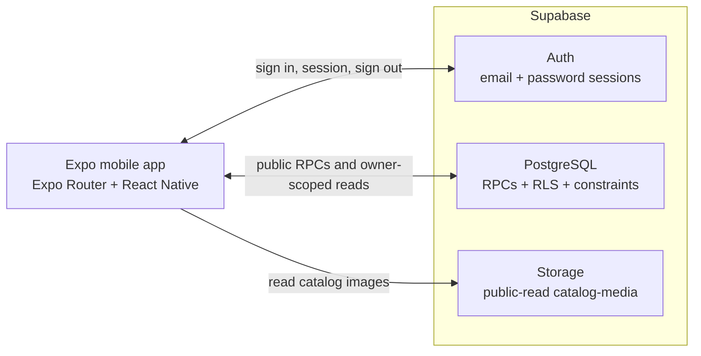

# Architecture



DirectStay is an Expo SDK 57 application backed by Supabase. The mobile bundle is an
untrusted client: it renders the experience and requests data, while PostgreSQL owns
shared business truth. The detailed rules are in [DOMAIN.md](DOMAIN.md), and the current
guest experience is in [PRODUCT.md](PRODUCT.md).

## Trust boundaries

The client may validate input for fast feedback, but only the server decides:

- which active catalog rows an organization-scoped RPC returns;
- whether a unit is available for dates and guest count;
- the quote and booking price, sourced from integer minor-unit rates;
- which booking and profile rows belong to the authenticated user;
- whether private stay information belongs to a confirmed booking owner; and
- whether an inventory claim conflicts with another claim.

These decisions are server-owned because every device can be modified, requests can race,
and authorization must hold even when navigation guards are bypassed. RLS isolates
owner-scoped rows, SECURITY DEFINER RPCs expose narrow use cases, and database constraints
protect invariants during concurrent writes. The Supabase anon key is public by design;
service-role and provider secrets must never enter the app bundle.

`create_booking` is transactional and server-authoritative, but is granted only to
`service_role`. The app can request quotes but cannot create or confirm a reservation.
See [Not yet implemented](#not-yet-implemented).

## Application layers

```text
Expo Router route
  → feature screen and components
    → TanStack Query hook
      → feature repository interface
        → Supabase repository
          → RPC or RLS-protected table
```

- `src/app` contains thin route files for the tab shell and stack routes.
- `src/features` groups screens, queries, types, and repository contracts by capability:
  auth, property, search, booking, stay, and profile.
- `src/lib` holds cross-cutting configuration, dates, formatting, errors, the query
  client, repository composition, and Supabase mapping.
- `src/components` contains shared presentation components.
- `src/i18n` owns translated UI resources.
- `src/mocks` contains test fixtures and in-memory repository implementations; production
  composition never imports it, and a static test guards that boundary.

Repository interfaces keep screens independent from Supabase payloads and make data-edge
tests deterministic. The root composes one Supabase client and the deployment's
organization slug into concrete repositories. Adapters translate RPC/table responses
into app models through validating mappers.

## Server state and sessions

TanStack Query owns asynchronous server state, retries, cache keys, and invalidation.
Keys include the inputs that change a result, such as locale, unit, dates, and guest count.
Loading, error, empty, and retry states are rendered by the feature screens.

`SessionProvider` restores the Supabase session and subscribes to auth changes. Public
catalog, unit, and availability routes work without a session. Profile, booking, and stay
routes use a navigation guard, but the actual boundary remains RLS and RPC authorization.
Protected deep links redirect through `/login`; redirect values are limited to internal
paths and reject sensitive-looking data. Sign-in and sign-out clear identity-scoped query
caches so one user's data cannot flash for another.

Authentication uses email and password. The app provides sign-in and sign-out, but no
self-service sign-up or password recovery.

## Data access

- `get_catalog` and `get_unit` return localized, active catalog data for the configured
  organization.
- `search_available_units` is the only availability and quote calculation used by the
  app. It applies capacity, active-state, booking, hold-expiry, and availability-block
  rules in PostgreSQL.
- Authenticated users read their own bookings and profile through RLS-protected tables.
- `get_stay_information` returns private property information only to the owner of a
  confirmed booking.
- Storage exposes catalog images for public reads and has no client write policy.

The app always uses organization-scoped RPCs for catalog reads. RLS also grants direct
read access to active catalog tables for `anon` and `authenticated`, so the configured
slug selects the brand experience but is not a confidentiality boundary.

The unique-unit overlap guarantee and status constraints are documented once in
[DOMAIN.md](DOMAIN.md#why-overlapping-reservations-cannot-be-inserted).

## Internationalization

All user-facing copy goes through i18next. Spanish (`es`) is the default, English (`en`)
is available, and CI tests locale-key parity. Server error codes are mapped to safe app
error codes before translation. Catalog translations are resolved by database read models
rather than assembled in screens.

## Environments and builds

`app.config.ts` selects the application name and iOS/Android identifier from
`EAS_BUILD_PROFILE`; `eas.json` defines the corresponding delivery behavior.

| EAS profile   | App identifier                            | Delivery                                            |
| ------------- | ----------------------------------------- | --------------------------------------------------- |
| `development` | `com.juanjosechiroque.directstay.dev`     | Internal development-client APK on Android          |
| `preview`     | `com.juanjosechiroque.directstay.preview` | Internal distribution                               |
| `production`  | `com.juanjosechiroque.directstay`         | Production channel with build-number auto-increment |

At startup, `src/lib/supabase/config.ts` validates
`EXPO_PUBLIC_SUPABASE_URL`, `EXPO_PUBLIC_SUPABASE_ANON_KEY`, and
`EXPO_PUBLIC_ORGANIZATION_SLUG`; `EXPO_PUBLIC_APP_ENV` accepts `local`, `development`,
`preview`, or `production` and defaults to `local`. Invalid configuration produces an
explicit app screen. Only public variables belong in the client bundle.

The project requires Node.js 24 and uses the [versioned Expo SDK 57
documentation](https://docs.expo.dev/versions/v57.0.0/).

## Continuous integration

GitHub Actions runs two independent jobs:

- Application validation installs with Node 24, runs Expo Doctor, TypeScript, ESLint,
  Jest in CI mode, and Prettier's format check.
- Database validation installs Supabase CLI 2.116.0, starts local Postgres/Auth/Storage,
  reapplies migrations and seed data, and runs the pgTAP suite.

This split verifies both client contracts and database security/concurrency behavior.

## Not yet implemented

- Mobile booking creation, payment, confirmation, refunds, and in-app cancellation.
- Stripe client/server integration, Supabase Edge Functions, and payment webhooks.
- Self-service registration and password recovery.
- An administrative interface or transactional RPC for creating availability blocks.
