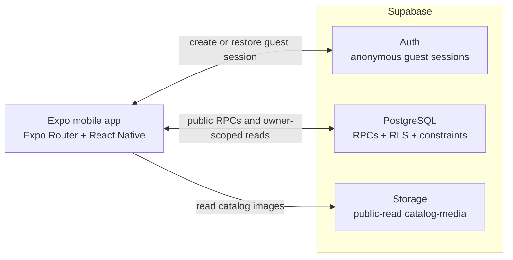

# Architecture



DirectStay is an Expo SDK 57 application backed by Supabase. The mobile bundle is an
untrusted client: it renders the experience and requests data, while PostgreSQL owns
shared business truth. The detailed rules are in [DOMAIN.md](DOMAIN.md), and the current
guest experience is in [PRODUCT.md](PRODUCT.md).

## Trust boundaries

The client may validate input for fast feedback, but only the server decides:

- which active catalog rows an organization-scoped RPC returns;
- whether a unit is available for dates and guest count;
- the quote and booking price, sourced from integer minor-unit rates;
- which booking and profile rows belong to the authenticated user;
- whether private stay information belongs to a confirmed booking owner; and
- whether an inventory claim conflicts with another claim.

These decisions are server-owned because every device can be modified, requests can race,
and authorization must hold even when navigation guards are bypassed. RLS isolates
owner-scoped rows, SECURITY DEFINER RPCs expose narrow use cases, and database constraints
protect invariants during concurrent writes. The Supabase anon key is public by design;
service-role and provider secrets must never enter the app bundle.

`create_booking` and `confirm_demo_payment` are transactional SECURITY DEFINER RPCs
granted to `authenticated` guests. The app submits guest details, an optional special
request, and then a booking id;
PostgreSQL alone sets the price, hold and confirmed status. Demo confirmation does not
create a Stripe payment record.

## Application layers

```text
Expo Router route
  → feature screen and components
    → TanStack Query hook
      → feature repository interface
        → Supabase repository
          → RPC or RLS-protected table
```

- `src/app` contains thin route files for the tab shell and stack routes.
- `src/features` groups screens, queries, types, and repository contracts by capability:
  auth, property, search, booking, and stay.
- `src/lib` holds cross-cutting configuration, dates, formatting, errors, the query
  client, repository composition, and Supabase mapping.
- `src/components` contains shared presentation components.
- `src/i18n` owns translated UI resources.

Repository interfaces keep screens independent from Supabase payloads and make data-edge
tests deterministic; data tests use small fake repositories local to each test. The root
composes one Supabase client and the deployment's organization slug into concrete
repositories. Adapters translate RPC/table responses into app models through validating
mappers.

## Server state and sessions

TanStack Query owns asynchronous server state, retries, cache keys, and invalidation.
Keys include the inputs that change a result, such as locale, property, unit, dates, and guest count.
Loading, error, empty, and retry states are rendered by the feature screens.

`SessionProvider` restores the persisted Supabase session and subscribes to auth changes.
Catalog, unit, availability, booking review, and guest details work without a session.
Submitting valid guest details creates an anonymous session only when no session exists;
Supabase persists it in AsyncStorage on that device. Booking and stay routes never redirect
to login. Without a session, reservation and stay screens return empty/not-found states;
the actual privacy boundary remains RLS and RPC authorization. Creating a session clears
identity-scoped query caches. The guest screen then creates a pending booking by RPC and
passes only its id to Payment. Payment reads the persisted booking price and deadline,
asks the confirmation RPC to change state, and invalidates booking, availability and stay
queries. An unexpired pending booking can reopen Payment from booking detail. The
confirmation route replaces Payment in navigation history.

## Data access

- `get_catalog` and `get_unit` return localized, active catalog data for the configured
  organization. The catalog may include a property's public map reference and coordinates.
  The property page displays the reference as an address, opens Google Maps at the
  property's coordinates when the server provides valid ones (falling back to a text search
  on the reference) without a Maps API key, and shows the property's public phone and contact
  actions.
- `search_available_units` is the only availability and quote calculation used by the
  app. Guest searches pass the selected property id, while unit quote requests pass the
  unit id. It applies capacity, active-state, booking, hold-expiry, and availability-block
  rules in PostgreSQL. While a remote deployment still has the earlier RPC signature,
  the repository retries that RPC without the property argument and narrows its
  server-computed public results to the selected property. The client does not calculate
  availability or price in either case.
- Anonymous authenticated users read their own bookings and profile through RLS-protected
  tables; the contact details used for a reservation live on the booking row. Booking
  history does not request `special_requests`, since cards do not display it. Detail reads
  retry without that field only when PostgreSQL reports that specific column is missing,
  so older remote schemas can still display booking details during rollout.
- `get_stay_information` returns private property information only to the owner of a
  confirmed booking.
- Storage exposes catalog images for public reads and has no client write policy.

The app always uses organization-scoped RPCs for catalog reads. RLS also grants direct
read access to active catalog tables for `anon` and `authenticated`, so the configured
slug selects the brand experience but is not a confidentiality boundary.

The unique-unit overlap guarantee and status constraints are documented once in
[DOMAIN.md](DOMAIN.md#why-overlapping-reservations-cannot-be-inserted).

## Database migrations and seed data

Migrations (`supabase/migrations`) hold schema, constraints, RLS, grants and RPCs, and are
never edited once applied to the remote project. Demo data (the Ayni Hospitality
organization, properties, units, rates, contacts and addresses) lives in `supabase/seed.sql`,
which `supabase db reset` applies after the migrations. Two early migrations
(`property_demo_addresses`, `property_demo_mobile_contacts`) only patched demo rows on the
already-deployed database; on a fresh reset they update zero rows and `seed.sql` supplies the
same values. New demo data goes in the seed, not in a migration.

## Internationalization

All user-facing copy goes through i18next. Spanish (`es`) is the default, English (`en`)
is available, and CI tests locale-key parity. Server error codes are mapped to safe app
error codes before translation. Catalog translations are resolved by database read models
rather than assembled in screens.

## Environments and builds

`app.config.ts` selects the application name and iOS/Android identifier from
`EAS_BUILD_PROFILE`; `eas.json` defines the corresponding delivery behavior.

| EAS profile   | App identifier                            | Delivery                                            |
| ------------- | ----------------------------------------- | --------------------------------------------------- |
| `development` | `com.juanjosechiroque.directstay.dev`     | Internal development-client APK on Android          |
| `preview`     | `com.juanjosechiroque.directstay.preview` | Internal distribution                               |
| `production`  | `com.juanjosechiroque.directstay`         | Production channel with build-number auto-increment |

At startup, `src/lib/supabase/config.ts` validates
`EXPO_PUBLIC_SUPABASE_URL`, `EXPO_PUBLIC_SUPABASE_ANON_KEY`, and
`EXPO_PUBLIC_ORGANIZATION_SLUG`. Invalid configuration produces an explicit app screen.
Only public variables belong in the client bundle.

The project requires Node.js 24 and uses the [versioned Expo SDK 57
documentation](https://docs.expo.dev/versions/v57.0.0/).

## Continuous integration

GitHub Actions runs two independent jobs:

- Application validation installs with Node 24, runs Expo Doctor, TypeScript, ESLint,
  Jest in CI mode, and Prettier's format check.
- Database validation installs Supabase CLI 2.116.0, starts local Postgres/Auth/Storage,
  reapplies migrations and seed data, and runs the pgTAP suite.

This split verifies both client contracts and database security/concurrency behavior.

## Testing

- **Unit:** pure logic (dates, money, validation, mappers, i18n catalog parity).
- **Data edge:** repositories and query invalidation against fakes or a stubbed client.
- **Components:** React Native Testing Library (RNTL) tests in `src/**/__tests__/*.test.tsx`,
  rendered through `src/test/render.tsx` (fresh TanStack Query client, Spanish i18n, injected
  fake repositories and a fake guest session). They query by accessible role, name and state.
- **pgTAP:** schema, RLS/grants, overlap constraints and RPC behavior (`supabase/tests/database`).
- **E2E (Maestro):** not implemented yet.
- **Performance harness:** `*.perf.tsx` files (e.g. `src/test/perf/lists.perf.tsx`) are run on
  demand with `npx jest --testMatch '**/*.perf.tsx' --runInBand`; they are excluded from `npm test`.

New devDependencies: `@testing-library/react-native` (component tests), `test-renderer` (the
renderer peer required by RNTL 14) and `@types/node` (Node 24 typings for `process.env` and
`NodeJS.ProcessEnv` in config).

## Not yet implemented

- Stripe client/server integration, real payments and payment webhooks.
- Refunds and in-app cancellation.
