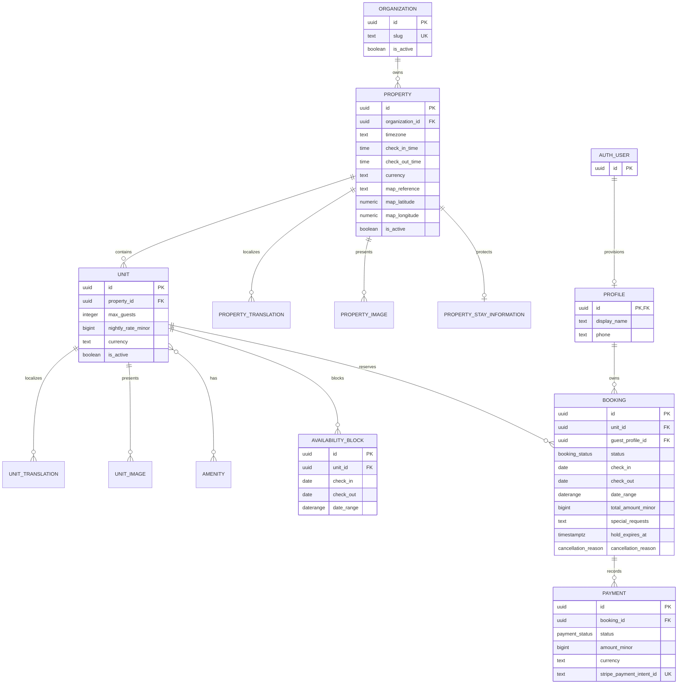
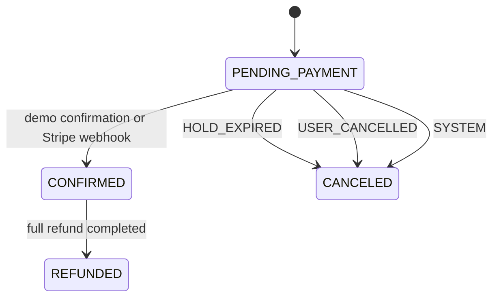
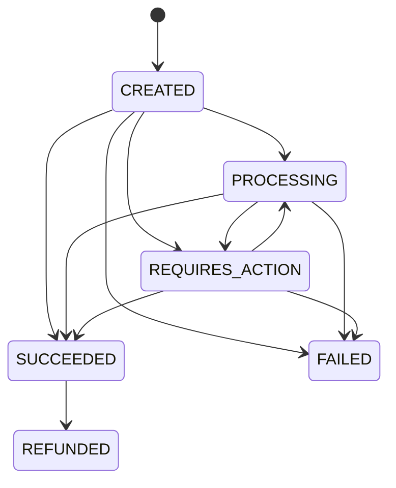

# Domain model

This document describes the business model and database invariants implemented by the
current Supabase migrations. System structure and trust boundaries live in
[ARCHITECTURE.md](ARCHITECTURE.md); the guest-facing scope lives in
[PRODUCT.md](PRODUCT.md).

## Core model

One app deployment is configured for one `Organization` (a brand), selected by
`EXPO_PUBLIC_ORGANIZATION_SLUG`. An organization has one or more `Property` records, and
each property has one or more `Unit` records. A unit belongs to the selected organization
through its property; a unit from a different organization cannot appear in that app's
catalog or availability results and cannot be booked with the selected slug.

A unit is a **specific, uniquely bookable accommodation**, not a room type backed by a
quantity of interchangeable inventory. This distinction is structural: PostgreSQL
prevents overlapping booking ranges for the same `unit_id`. Modeling a room type would
require a separate inventory-allocation model that does not exist here.

The diagram omits catalog join-table columns for readability. The schema also contains
localized image text, unit amenities, property highlights, and media provenance. There
are no persisted stays, extras, service-request workflows, reviews, chat, housekeeping,
or room-type inventory entities. A booking may carry one free-text special request.

## Catalog, localization, and media

The app lists and searches only active properties and units belonging to its selected,
active organization. Catalog/detail/search RPCs apply the organization slug and all three
activation flags. `create_booking` checks again in PostgreSQL that the requested unit
belongs to an active property of that same active organization. A mismatched unit and slug
are rejected, even if a modified client bypasses the app's screens.

`EXPO_PUBLIC_ORGANIZATION_SLUG` is public client configuration. A modified client could
submit another organization's slug together with one of that organization's units when
both brands share a Supabase project. The checks above keep each request within the brand
it names; they do not authenticate which app sent the request. RLS also permits direct
reads of active public catalog rows across organizations. If exclusive app-to-brand
authorization becomes a requirement, use an isolated Supabase project per brand or a
trusted server-side app-to-organization mapping.

Localized catalog copy is stored by `(entity_id, locale)` in property and unit translation
tables. Base tables retain fallback copy; proper unit names are not translated. Spanish is
the default UI locale, and English resources already exist.

Each property may expose a public `map_reference`, displayed as its address and passed
to a Google Maps search URL. Paired coordinates remain optional but are not used by the
current client. The Ayni demo addresses are illustrative and must be replaced with
verified property addresses before serving real guests. Its contact numbers are also
illustrative and are not verified WhatsApp accounts.

Catalog images are served from the public-read `catalog-media` bucket. Client roles have
no upload, update, or delete policy. Image records can store source, author, license,
attribution, verification, and localized alt-text metadata. Supported non-null licenses
are `CC0`, `PUBLIC_DOMAIN`, `CC_BY`, `CC_BY_SA`, and `COMMERCIAL`. The UI renders a local
gradient when an image URL is missing or fails to load.

## Guests and private stay information

Supabase Auth owns guest identities. Guests use anonymous Supabase users (`is_anonymous =
true`) without login credentials; these users still receive the `authenticated` Postgres
role and a stable `auth.uid()` on their device. An `auth.users` insert triggers creation
of the matching `profiles` row. Clients cannot insert profiles and may read or update only
their own profile row. Guest name, email, phone, and special requests belong to the
reservation, not the profile.

The anonymous identity is tied to its device. A guest who installs the app elsewhere cannot
recover those reservations. Anonymous sign-in has a local IP-based limit of 30 per hour
in `supabase/config.toml`; configure the remote limit in Supabase Dashboard →
Authentication → Rate Limits. The database allows one pending booking per guest to limit
abandoned holds in addition to protecting inventory transactionally.

Wi-Fi details, breakfast information, arrival instructions, and directions live in
`property_stay_information`. Direct client reads are denied. The authenticated
`get_stay_information(booking_id)` RPC returns them only when `auth.uid()` owns that
booking and its status is `CONFIRMED`. Other guests and all other booking statuses receive
no stay information.

## Dates, pricing, and availability

Booking and availability intervals are half-open: `[check_in, check_out)`. Check-in is
included, check-out is excluded, so one guest may leave on the date another arrives.
These values are business `DATE`s interpreted with the property's stored timezone and
check-in/check-out times.

Persisted money uses integer minor units plus a three-letter currency. A quote is the
unit's nightly rate multiplied by the number of nights; taxes, fees, discounts, dynamic
pricing, and occupancy pricing are not modeled. `create_booking` copies the server-held
rate and total into the booking, preserving a historical pricing snapshot. The client
does not submit an authoritative price.

The booking RPC rejects check-in before today in the property timezone with
`invalid_date_range`.

A guest may attach an optional special request of up to 500 characters to the booking.
The request is stored with the owner-scoped booking, not in the public catalog or guest
profile, and does not guarantee that the property can fulfill it.

`search_available_units` can narrow a search to a selected property or unique unit. The
guest-facing search always selects one property; unit quotes use the unit filter. The RPC
checks the active brand/property/unit, guest capacity,
availability blocks, confirmed bookings, and pending bookings whose hold has not expired.
Canceled, refunded, and expired pending bookings do not appear as inventory claims in
search results.

An availability block represents a unit being unavailable for a non-booking reason. It
participates in search and is checked again in `create_booking`. A per-unit advisory lock
is shared by booking creation and a database trigger for administrative block inserts and
updates. Either transaction waits for the other and validates against committed state, so
they cannot both commit an overlapping reservation and block. Intervals use `[)`; adjacent
blocks and bookings at check-out/check-in do not overlap.

## Booking lifecycle and five-minute hold

Every booking starts as `PENDING_PAYMENT`; there is no separate hold table. PostgreSQL
requires `hold_expires_at = created_at + interval '5 minutes'`, so the hold is exactly
five minutes.

The authenticated `create_booking` RPC receives the selected organization slug and
validates that it names an active organization which owns the requested active property
and unit. It validates guest count and dates, obtains price and currency from the unit,
cancels any previous pending booking for the same guest with `SYSTEM`, cancels expired
pending bookings for the requested unit, and inserts a new pending booking in the same
transaction. Organization, activation, capacity, dates and blocks are validated before
the old pending hold is canceled. A guest advisory lock serializes that guest's booking
requests; a second per-unit advisory lock serializes inventory writes with administrative
block inserts/updates. Booking paths acquire guest lock, then unit lock, then row locks;
block writes take the unit lock before checking bookings. No path takes these locks in
reverse. Time passing alone does not change
a row to `CANCELED`: there is no scheduled expiry job. Search ignores an expired hold,
and the next `create_booking` call for that unit records `HOLD_EXPIRED` before inserting.
The confirmation RPC also cancels an expired pending booking.
The booking detail can reopen the demonstration payment screen while a pending hold is
still valid; that screen rechecks the absolute deadline and the server remains the only
authority that confirms payment.

The `booking_status` enum is `PENDING_PAYMENT | CONFIRMED | CANCELED | REFUNDED`. Database
checks require fields consistent with each state:

- `PENDING_PAYMENT` has no confirmation, cancellation, or refund timestamp.
- `CONFIRMED` has `confirmed_at` only.
- `CANCELED` has `canceled_at` and exactly one enum cancellation reason:
  `HOLD_EXPIRED`, `USER_CANCELLED`, or `SYSTEM`.
- `REFUNDED` retains `confirmed_at` and has `refunded_at`; it is not marked canceled.

The diagram records the supported domain lifecycle. The migrations validate each row's
state and companion fields, but no database trigger currently compares the old and new
status to enforce transition history.

For now, only the booking owner can call `confirm_demo_payment`. It locks the booking row,
returns an already confirmed booking unchanged, and confirms a pending booking only while
its five-minute hold is valid. If the hold expired, it returns the newly canceled row with
`HOLD_EXPIRED`; returning commits that cancellation, whereas raising an exception would
roll it back. The app treats that response as an expired hold. Other states and unknown
or foreign bookings return `not_found`. Demo confirmation creates no `payments` row. A
Stripe webhook will replace this confirmation provider without changing the guest screens.

The booking detail UI calculates a cancellation deadline 24 hours before the property's
local check-in time. It offers property contact and does not submit a cancellation. This
deadline is not enforced by PostgreSQL because no cancellation operation exists.

## Expected Stripe PaymentIntent lifecycle (not enforced by the schema)

The schema separates payment attempts from bookings. Each payment has a unique Stripe
PaymentIntent identifier, and a partial unique index allows at most one `SUCCEEDED`
payment per booking. Stripe event and refund identifiers are also unique when present.
Refund checks require a full refund, a refund identifier, and success and refund
timestamps.

The `payment_status` enum is `CREATED | PROCESSING | REQUIRES_ACTION | SUCCEEDED | FAILED |
REFUNDED`. SQL checks require `succeeded_at` for success, `failed_at` for failure, and a
full refunded amount for `REFUNDED`. As with bookings, the schema validates state shape,
not the previous-to-next transition. No runtime payment processor writes these records
today.

## Why overlapping reservations cannot be inserted

`bookings.date_range` is a generated PostgreSQL `daterange(check_in, check_out, '[)')`.
A partial GiST exclusion constraint combines equality on `unit_id` with range overlap
(`&&`) for `PENDING_PAYMENT` and `CONFIRMED` rows. PostgreSQL evaluates that constraint
while concurrent transactions write, so two callers cannot both commit overlapping
inventory claims for the same unique unit; one insert is rejected with `23P01`.

The booking RPC first cancels expired pending rows for the requested unit because the
constraint intentionally considers every row still marked `PENDING_PAYMENT`, while public
availability ignores pending rows after their five-minute expiry. This cleanup and the
constraint make the write path safe without relying on a prior client-side availability
check. The shared unit lock also coordinates booking writes with availability-block writes.

## Calendar and payment countdown

Only a `CONFIRMED` booking offers “Añadir estancia al calendario”, on confirmation and
booking detail. Permission is requested after the guest presses the action, then SDK 57's
system event form opens prefilled. The event is an all-day interval built from local date
parts `[check_in, check_out)`, with a localized title containing property and unit names.
No location is included until verified. Contact details, special requests, Wi-Fi and
private identifiers are excluded. The native form owns the save decision; Android does not
report whether the event was saved, so the app does not claim success.

Payment displays the existing five-minute countdown against absolute server
`hold_expires_at`. It ticks only on the focused, foreground payment screen for a pending,
unexpired booking and stops at confirmation or expiry. Server confirmation remains
authoritative; expiry disables the action and points back to search.

## Not yet implemented

- Stripe SDKs, PaymentSheet, Edge Functions, webhooks, real payment processing, refunds,
  and in-app cancellation do not exist.
- When payment processing is implemented, a payment arriving after its booking hold has
  expired must not confirm that booking; the late payment is automatically refunded.
- A paid booking must never become `CANCELED`; a paid booking that is refunded moves to
  `REFUNDED`.
- No scheduled hold-expiry cleanup exists.
- If a scheduled expiry job is added, it is cleanup only. Database constraints and the
  transactional booking operation remain the protection against overlapping claims.
